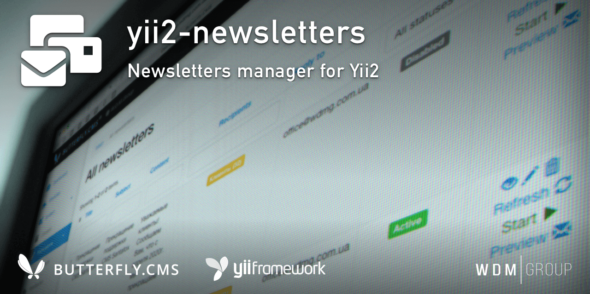

# Yii2 Newsletters
Newsletters manager for Yii2.

This module is an integral part of the [Butterfly.СMS](https://butterflycms.com/) content management system, but can also be used as an standalone extension.

Copyrights (c) 2019-2021 [W.D.M.Group, Ukraine](https://wdmg.com.ua/)

# Requirements 
* PHP 5.6 or higher
* Yii2 v.2.0.40 and newest
* [Yii2 Base](https://github.com/wdmg/yii2-base) module (required)
* [Yii2 Mailer](https://github.com/wdmg/yii2-mailer) module (optionality)
* [Yii2 Options](https://github.com/wdmg/yii2-options) module (optionality)
* [Yii2 Editor](https://github.com/wdmg/yii2-editor) module (required)
* [Yii2 TagsInput](https://github.com/wdmg/yii2-tagsinput) widget (required)
* [Yii2 SelectInput](https://github.com/wdmg/yii2-selectinput) widget (required)
* [Yii2 Validators](https://github.com/wdmg/yii2-validators) (required)

# Installation
To install the module, run the following command in the console:

`$ composer require "wdmg/yii2-newsletters"`

After configure db connection, run the following command in the console:

`$ php yii newsletters/init`

And select the operation you want to perform:
  1) Apply all module migrations
  2) Revert all module migrations

# Migrations
In any case, you can execute the migration and create the initial data, run the following command in the console:

`$ php yii migrate --migrationPath=@vendor/wdmg/yii2-newsletters/migrations`

# Configure
To add a module to the project, add the following data in your configuration file:

    'modules' => [
        ...
        'newsletters' => [
            'class' => 'wdmg\newsletters\Module',
            'routePrefix' => 'admin'
        ],
        ...
    ],

# Routing
Use the `Module::dashboardNavItems()` method of the module to generate a navigation items list for NavBar, like this:

    <?php
        echo Nav::widget([
        'options' => ['class' => 'navbar-nav navbar-right'],
            'label' => 'Modules',
            'items' => [
                Yii::$app->getModule('newsletters')->dashboardNavItems(),
                ...
            ]
        ]);
    ?>

# Status and version [ready to use]
* v.1.0.11 - Show modal call fixed and counter stats
* v.1.0.10 - RBAC implementation
* v.1.0.9 - Update dependencies, README.md
* v.1.0.8 - Log activity
* v.1.0.7 - Up to date dependencies
* v.1.0.6 - Fixed count of emails in views and models
* v.1.0.5 - Refactoring. Migrations bugfix
* v.1.0.4 - Fixed bug with save workflow and recipients list